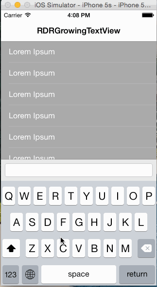

# RDRGrowingTextView
Auto Layout backed growing UITextView.

Use in any Auto Layout constrained view hierarchy. Add a less-than-or-equal height constraint on the view itself to restrict its height to a maximum.

# Example
The sample project demonstrates how to use the class in combination with an interactively dismissable keyboard. This behavior is seen in apps such as iMessage and Whatsapp.

# License
RDRGrowingTextView is released under the MIT license. Please see the `LICENSE` file for more details.
